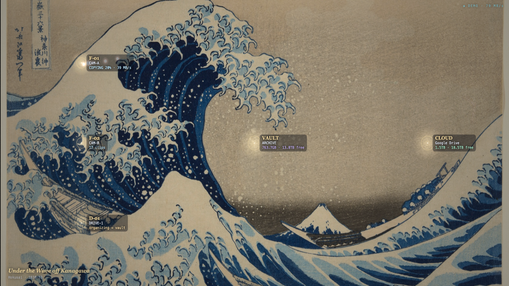

# Lumina

*A screensaver that turns the quiet work of your machines into light moving across old masterworks.*

Files travel all the time. A photo copies to a backup drive. A folder climbs to the cloud at
3am while you sleep. You never see any of it. Lumina makes it visible. Every transfer becomes a
small comet of light, and the light crosses a slow rotation of public-domain masterworks,
picking up the color of whatever paint it floats over. The same backup glows gold across
Hokusai's sky and deep blue through the shadow of the wave.

It is one HTML file. No build, no install, no account. Open it and watch.



## Why this exists

Data has a reputation for being cold. Rows, bytes, throughput, the language of spreadsheets.
But watch a drive copy 400 gigabytes some night and tell me it isn't a kind of weather. Things
move. They pool and rush and go quiet. There is labor in it, the patient unglamorous labor of
keeping something safe, and labor has always been worth looking at.

Lumina takes that hidden movement and hangs it inside pictures that have been looking back at
us for centuries. The point is simple. The work your machines do for you is already beautiful.
This just gives it somewhere beautiful to happen.

## Run it

```bash
./serve.sh            # opens http://localhost:8787 with built-in demo data
./serve.sh --demo     # same, but the numbers wander on a timer
```

Click the page to go fullscreen. That is the whole interface.

## The seven works

Four paintings, a woodblock print, an etching, and a pen-and-ink drawing. Chosen for darkness
and motion, so the data is the only thing truly alight. Each one moves your data its own way.

| Work | Artist, year | How the light moves |
|---|---|---|
| Under the Wave off Kanagawa | Hokusai, 1830–33 | surges in a high curl, like the wave |
| Nocturne: Blue and Gold | Whistler, 1872 | drifts low and slow, lamplight on water |
| Moonlight, Night in St Cloud | Munch, 1895 | cool and vertical, moonlit |
| Ships at Sea During Storm | Jules Dupré, 1830–49 | fast, tossed, like spray |
| Moonrise | George Inness, 1891 | gentle and sparse, rising |
| The Assumption of the Virgin | El Greco, 1577–79 | climbs upward, heavenward |
| The Girl by the Window | Munch, 1893 | quiet, turned inward |

Every one is public domain. See [CREDITS.md](CREDITS.md) for sources and exact media, and
[MUSEUMS.md](MUSEUMS.md) for where to stand in front of them.

## Feed it your own data

The page reads a small `state.json` every couple of seconds. Hand it this shape and it animates:

```json
{
  "ts": "14:22:01",
  "totalSpeed": 90,
  "drives": [
    {"name":"CAM-A","role":"source","kind":"camera-sony","label":"F-01","clips":42,"total":1000000000000,"used":520000000000},
    {"name":"ARCHIVE","role":"archive","kind":"archive","total":16000000000000,"used":820000000000}
  ],
  "cloud": {"name":"Cloud","used":1700000000000,"total":22000000000000},
  "edges": [
    {"from":"CAM-A","to":"cloud","kind":"footage","pct":63,"speed":47}
  ]
}
```

Each `edge` is an active transfer and becomes a stream of comets. `to` is `"vault"` or `"cloud"`.
`kind: footage` runs warm, `kind: data` runs cool. Write that file from anything. A backup
script, a `df` loop, an rsync wrapper. Lumina does not care where it comes from. It just reads.

## Make it yours

Open `index.html` and edit the `ART` list near the top. Drop your own public-domain images into
`art/`, then tune each work: `b` brightness, `v` vignette, `sp` speed, `arc` how high the light
arcs. The whole thing is meant to be taken apart.

## Read more

- [Poems](POETRY.md), on why a moving file might be art.
- [Museums](MUSEUMS.md), where these paintings live and where to find a thousand more you can use.
- [Credits](CREDITS.md), the provenance of every image.

## License

The code is [MIT](LICENSE). The paintings are public domain. Take it, fork it, put your own life
on the wall.
